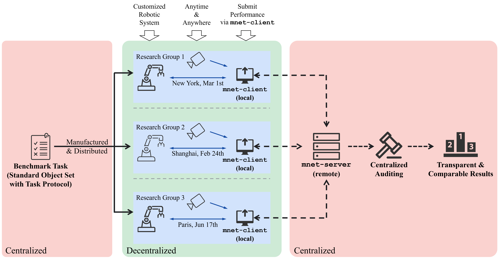

<!--- # ManipulationNet: Benchmarking Real-World Robotic Manipulation at Scale -->




## Overview

Welcome to ManipulationNet! ManipulationNet ([manipulation-net.org](https://manipulation-net.org/)) is a framework to host various real-world manipulation benchmarks by 1. delivering standardized task setups worldwide; and 2. evaluating authentic task performance without time, location, and system constraints.


Select your interested benchmark task [here](https://manipulation-net.org/index.html#tasks), and get registered [here](https://manipulation-net.org/registration.html).


## News

[**2025-11-12**] The mnet-client has been updated for the grasping_in_clutter task (CameraInfo will be required). Please check the newest docs, **update** your environment and your client before use.

[**2025-10-24**] We provided [example tasks](https://github.com/ManipulationNet/mnet_block_arrangement_example_instructions) for the block arrangement benchmark, and updated the mnet-client. Please [update](https://mnet-client.readthedocs.io/ros_2/installation.html#update-your-client) your client before submission.

[**2025-10-08**] Project released at [manipulation-net.org](https://manipulation-net.org/).


## What is mnet-client?

The mnet-client is a **middle layer** between the **robotic system** and the **mnet-server** to support distributed manipulation benchmarking on standardized task setups. The robotic system communicates with the mnet-client through ROS services and topics. In general, the mnet-client is responsible for: 

1. **collect** authentic manipulation performance on standardized task setups and upload it to the server for comparable research;

2. **deliver** task instructions from the server to the robotic system in real-time, this could involve language/visual prompts, task-specific instructions, and more;

3. **report** task execution and human intervention logs from the robotic system to the server in real-time to better describe the manipulation performance.

   

## Documentation

Please refer to https://mnet-client.readthedocs.io/ for more details about installation and usage. 

We have ROS 1 and ROS 2 supported.

## Tweaks (PLEASE READ ME BEFORE DIVING INTO INSTALLATIONS)

In order to install mnet-client properly and run the evaluations bug-free, please follow the additional instructions below (as we noted):

### Launch camera node (in a separate terminal)
```
cd ~/ros2_ws
ros2 launch realsense2_camera rs_launch.py
```

### Launch local test (in a separate terminal)
```
source ~/mnet_client_venv_new/bin/activate
cd ~/ros2_ws
colcon build --packages-select mnet_client
source /opt/ros/jazzy/setup.bash
source install/setup.bash
ros2 run mnet_client local_test
```

### Camera view (Optional: returns camera feed; in a separate terminal)
```
source /opt/ros/jazzy/setup.bash
cd ~/ros2_ws
ros2 run image_tools showimage --ros-args -r image:=/camera/camera/color/image_raw
```

### During test
#### (Optional: returns what task you are on; in a separate terminal)
```
ros2 topic echo /mnet_client/ongoing_task
```
#### (returns visualization of object placements for the current task; in a separate terminal)
```
ros2 run image_view image_view --ros-args -r image:=/mnet_client/current_vision_instruction  
```
#### (mark the current task skipped or completed to move onto the next one; in a separate terminal)
```
ros2 service call /mnet_client/current_task_finished std_srvs/srv/Trigger "{}"
```

```
ros2 service call /mnet_client/current_task_skipped  std_srvs/srv/Trigger "{}"
```

## Add this line to setup.cfg to avoid package not found error for ROS + venv (already done)
```
[build_scripts]
executable = /usr/bin/env python3
```

## How to fix "[ERROR:0@16.343] global cap_ffmpeg_impl.hpp:3207 open Could not find encoder for codec_id=27, error: Encoder not found"
https://stackoverflow.com/questions/70247344/save-video-in-opencv-with-h264-codec
### Install system OpenCV + ffmpeg + x264
```
sudo apt update
sudo apt install -y python3-opencv ffmpeg libx264-dev
```
### [IMPORTANT] Create venv with: python3.12 -m venv ~/mnet_client_venv_new --system-site-packages
for the steps in https://mnet-client.readthedocs.io/ros_2/installation.html, SKIP PIP OPENCV INSTALLATION; USE SYSTEM ONE!
```
apt installations.... (on the website)
pip install requests pydantic>=2.0 pybullet pyyaml pupil-apriltags tqdm
```
### Verify the cv2 in use is the system one
```
python3 - <<'PY'
import cv2, sys
print("cv2 path:", getattr(cv2, "__file__", None))
print("cv2 version:", getattr(cv2, "__version__", None))
print("Has FFMPEG?", hasattr(cv2, "getBuildInformation") and ("FFMPEG" in cv2.getBuildInformation()))
PY
```


## Contact

If you have any questions, please do not hesitate to contact support@manipulation-net.org
