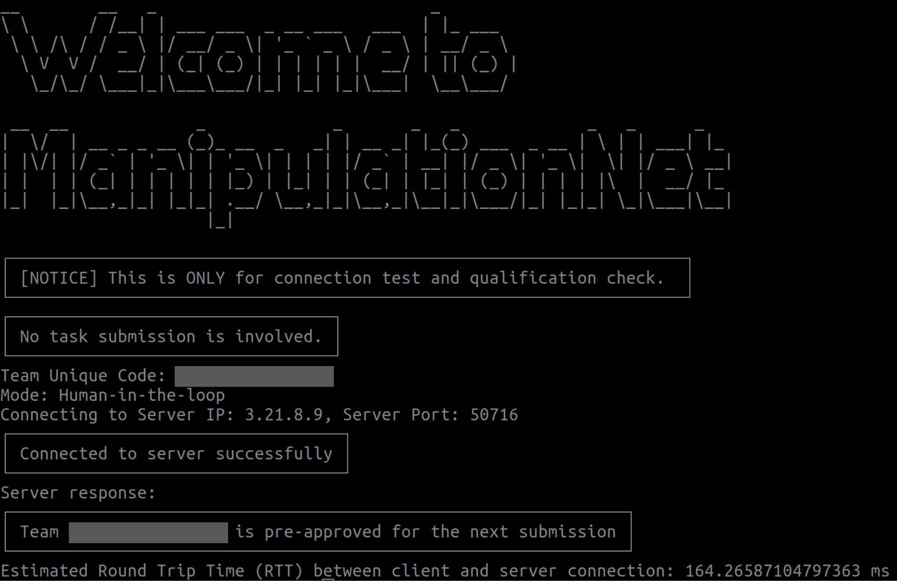
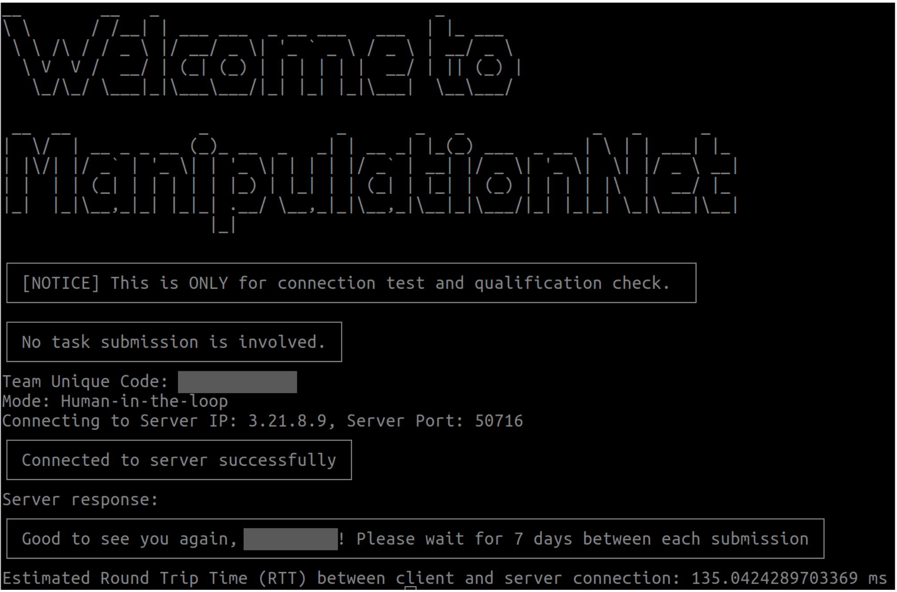
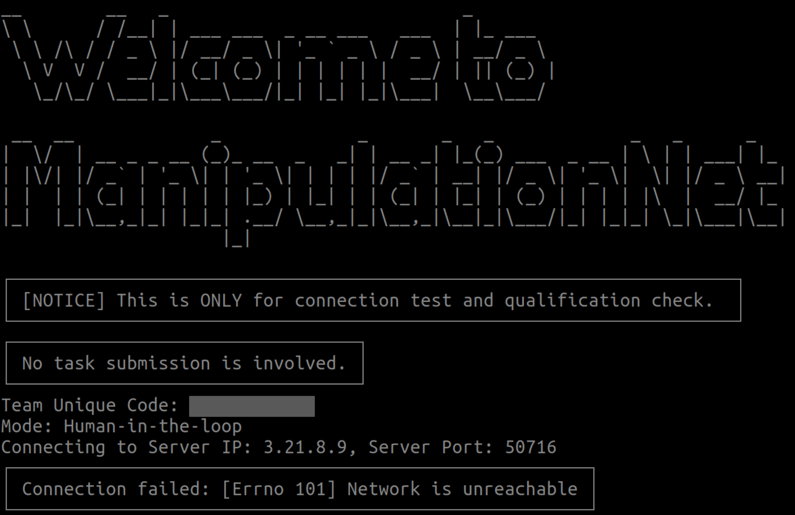
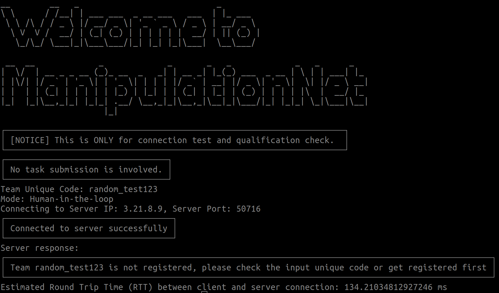

# Connection Test

This page provides detailed instructions to test the server-client connection and pre-check if the participant is approved for the submission at the current moment. Please contact the organizers if you encounter any questions: support@manipulation-net.org


**Notice**: Please open the terminal images in new tabs for a more readable view.


After you have properly configured the client with your team information at:

```
mnet_client/config/team_config.json
```

**Notice**: Do not forget to re-compile your workspace if needed


You can test the connection status with the mnet-server and check if your team is qualified for the next submission at this moment:

```
ros2 run mnet_client connection_test
```

**Notice**: Do not forget to source your ROS workspace.


✅️**If the connection is successful and the team is approved for submission:**




❌️**If the connection is successful and the team is NOT approved for submission:**




❌️**If the connection is failed:**




❌️**If the team unique code is NOT recognized:**


