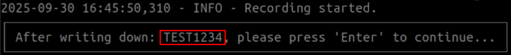
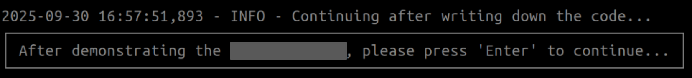
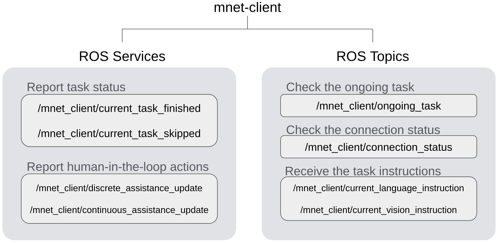

# General

Before we step into the details of the mnet-client, we first introduce a few general concepts that will be used by ManipulationNet.


## Get Registered

ManipulationNet delivers standardized task setups for registered teams to enable comparable research across the globe. Please get registered first [here](https://manipulation-net.org/registration.html).


## Team Unique Code

The team_unique_code is the identification code that is assigned per team per task. A team participating in multiple tasks will receive distinct codes for each task. You can consider the team_unique_code as a combination of your account name with a password to log in to the mnet-server, so please take care of it and do not share or publish it.

The team_unique_code identifies your team identity and the registered benchmark task. A team receives a different team_unique_code for a different registered benchmark. 


Read more at the [Terms and Conditions](https://manipulation-net.org/terms_and_conditions.html).


## One-time Code

The one-time code, or one-time submission code, is a random string generated by the server in real-time when a new submission attempt is registered. You can consider the one-time code as the identification code for each performance submission. The participant is required to place this code inside the camera view throughout the manipulation process to bind the video content to the real-time manipulation. You will see a prompt in the mnet-client terminal to instruct you about this step:



As an example, when the prompt shows up, the participant is required to write down "TEST1234" on a paper and place it inside the camera view before the manipulation task starts.


## Demonstrations of the Objects (Optional)

In some benchmark tasks, there could be a requirement to ask for demonstrations of the manipulated objects in front of the camera in a pre-specified manner. Please carefully read the task description on each task's official page. The client reserves a step for the participant to complete this demonstration if required, as shown in the following prompt:



**Notice**: Please read the task page carefully. If the benchmark task does not require this step, the participant can directly press 'Enter' to skip it. 


## Autonomy Level

- **Full Autonomous (2):** The robot must complete the entire task without human intervention. For example, the manipulation system is required to autonomously call the ROS services to report execution status and check the corresponding ROS topic to receive the task instructions.
- **Human-in-the-loop (1):** Humans may provide high-level assistance, for example, instructing the system to skip or confirm the completeness of a task, but cannot issue direct action control commands. Each human intervention is required to be logged to better describe the manipulation process. See more details about how to log human assistance here.
- **Teleoperation (0):** Humans are allowed to directly send action commands to the robot through any type of teleoperation. 


Each specific benchmark task might allow the participants to use an arbitrary autonomy level to finish it or require only a specific autonomy level. Details about the requirement for each task can be found at [manipulation-net.org](https://manipulation-net.org/). 


## What mnet-client provides?

- A **submission_client** to communicate with the ManipulationNet server for formal performance submission
- A **local_test_client** to test the local setup and provide a simulated environment for participants to get familiar with the real submission process
- A **connection_test** script to help participants check their Internet connection and qualification status before the real submission


## How mnet-client works?

### 1. configure your team information

To verify your identity, benchmark task, and register your submission, please properly configure the JSON file located at:

```
/mnet_client/config/team_config.json
```

You will be asked to input the following information correctly:

- **team_unique_code**: The unique code received from your registration that represents your team identity and the benchmark task
- **camera_image_topic**: The ROS topic (sensor_msg/Image) that publishes the video frames from your local camera (the minimum FPS requirement is 25)
- **camera_info_topic**: The ROS topic (sensor_msg/CameraInfo) that publishes the camera's intrinsic matrix, height and width information. Required for task grasping_in_clutter.
- **file_dir**: The local directory path to save your performance video and log file. An absolute path is recommended.
- **autonomy_level**:  0 for tele-operation, 1 for human-in-the-loop and 2 for fully autonomous as defined above.

**Notice**: If you use "colcon build" for compilation, do not forget to compile your ROS 2 workspace again after configuring the team info.

### 2. test your manipulation system locally

To ensure that the camera is properly connected to your local machine and your manipulation system is fully prepared for a formal submission, we provide a local test client for you to experience the same submission process without a server connection. After your team's JSON file is properly configured, please run the following command to launch the local test client:

```shell
ros2 run mnet_client local_test
```

After launching the local test client, you can check the current target task at the ROS topic:

```
/mnet_client/ongoing_task
```

To report the execution status **(binary status as finished or skipped)** on the ongoing task, you can use "**std_srvs/srv/Trigger**" to call the following ROS service:

```
/mnet_client/current_task_finished #if the execution of the current task is finished
```

Or

```
/mnet_client/current_task_skipped #if the current task is skipped
```

If you are using the human-in-the-loop as the autonomy mode for some tasks, you can report the human assistance actions using "**std_srvs/srv/Trigger**" to call the corresponding service:

```
/mnet_client/discrete_assistance_update #if your human assistance is only a discrete command or message
```

Or

```
/mnet_client/continuous_assistance_update #if your human assistance requires a continuous period of time, call once at the beginning of your assistance and call once at the end of your assistance.
```

### 3. check the connection status before the submission

To help participants check their current network conditions and whether they are qualified for the upcoming submission, we provide a simple script to check the server connection and test if the submission will be approved.

After your team's JSON file is properly configured at step 1, run the following command:

```
ros2 run mnet_client connection_test
```

### 4. submit your performance

After everything is properly configured, including your network, camera, client, and manipulation system, you can run the following command to start your official submission. Be careful with this step because you only have a limited chance per week to upload your performance:

```
ros2 run mnet_client submission
```

**Notice**: The usage of the submission client is identical to the local test client.

During the submission process, we log every detail and provide an additional ROS topic to check the connection status between the client and the server:

```
/mnet_client/connection_status
```

You can check the current ongoing task and report the execution status **(binary status as finished or skipped)**  in the same way as you experienced in the local test client. The submission is considered finished when it meets one of the following conditions:

- You have finished/skipped all the tasks from the benchmark
- You have reached the time limit
- You have manually finished your submission by typing "FINISH" and pressing 'ENTER'


## Services and Topics 

An overview of the services and topics provided by the mnet-client is visualized as follows. Services and topics are *selectively* enabled based on each specific benchmark task.


*Service "/discrete_assistance_update" and "/continuous_assistance_update" are only initialized in human-in-the-loop (1) and teleoperation (0).


