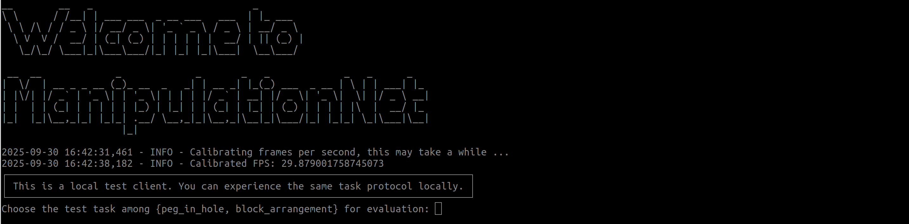
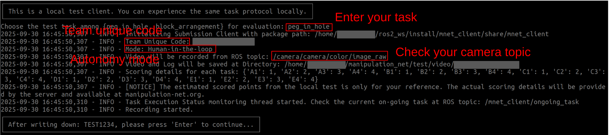
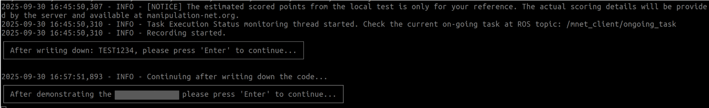
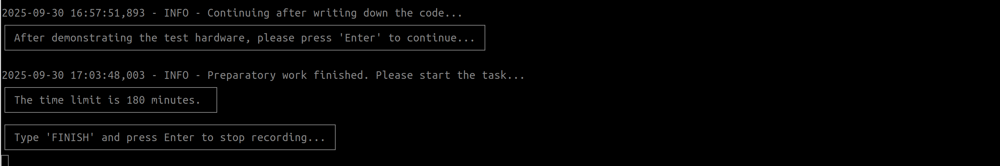
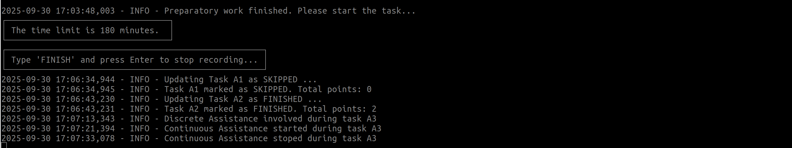
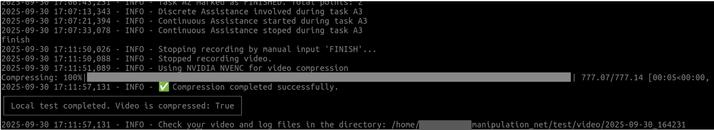

# Local Test

This page provides detailed instructions to use the Local Test Client to experience the submission process.


**Notice**: Please open the terminal images in new tabs for a more readable view.


## Preparatory work

1. Construct your manipulation system based on the specific benchmark task your team has chosen.  Please carefully read the benchmark details as documented at the official page for each task, including the objects involved, scene initial state, sub-goals, and overall protocols. 

2. Prepare your manipulation workspace as required by the chosen benchmark task. For example, for the block arrangement task, you are required to clearly mark two areas on the table surface, one for preparing all the blocks and the other for constructing the layout.
3. Prepare an additional camera (we name it the evaluation camera throughout this page) to provide a clear view of your manipulation workspace. This camera should record the whole manipulation process without any occlusion.
4. Configure your client with your team_unique_code (will be provided after registration), your camera topic from step 3, and other required information.
5. Prepare a marker pen and clean paper. 


## Client Usage

After you have finished the preparatory work, you can experience the simulated submission process locally by using the local test client.

1. Launch the evaluation camera, check that its view is clear and the frame streaming is stable.

2. Launch the local test client using:

   ```
   ros2 run mnet_client local_test
   ```

   **Notice**: Do not forget to source your ROS workspace in the terminal.

3. Wait the client to check the environment and calculate the camera FPS, then input the task name and press 'Enter':

   

   **Notice**: In the real submission, this step will be skipped since the server will know your benchmark task based on your team_unique_code.

4. Here we use peg_in_hole as an example. The task details is loaded locally, each task has different protocols, please visit the official website for more details.

   

5. Write down the one-time code: TEST1234 on the paper with the marker pen, and place the paper inside the camera view.

6. Press 'Enter' and proceed with the next step. The peg-in-hole task requires demonstration of the manipulated object before the task starts, see more details at the [task page](https://manipulation-net.org/tasks/peg_in_hole.html):

   

7. **Press 'Enter' to start the task execution, at this time, you should start your manipulation system to execute the tasks:**

   

8. Based on your autonomy level, call the ROS service with Trigger to report the execution status or human assistance:

9. Meanwhile, if the benchmark tasks provide task instructions (not provided in the peg-in-hole task), you can receive the instructions at ROS topics for the ongoing task:

   ```
   /mnet_client/current_vision_instruction
   ```

   ```
   /mnet_client/current_language_instruction
   ```

10. After you consider finishing the task, type in "finish" in the same terminal and press "Enter" to exit


## Tips

1. You can experience the usage of the local test client without a robot. Play with the following command to get familiar with the client

   ```
   ros2 service call /mnet_client/current_task_finished std_srvs/srv/Trigger
   ```

   ```
   ros2 service call /mnet_client/current_task_skipped std_srvs/srv/Trigger
   ```

   ```
   ros2 service call /mnet_client/discrete_assistance_update std_srvs/srv/Trigger 
   ```

   ```
   ros2 service call /mnet_client/continuous_assistance_update std_srvs/srv/Trigger
   ```

   ```
   ros2 topic echo /mnet_client/current_vision_instruction
   ```

   ```
   ros2 topic echo /mnet_client/current_language_instruction
   ```

   ```
   ros2 topic echo /mnet_client/ongoing_task
   ```

2. Check your recorded performance video to ensure the view is clear and the quality is good.

3. Each task might have completely different protocols; please follow the official page and use the client properly.

