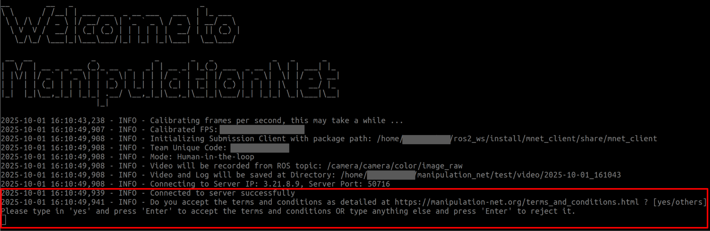
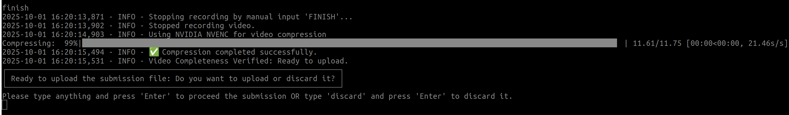

# Submission

This page provides detailed instructions to launch the submission client for performance submission

**Notice**: Please open the terminal images in new tabs for a more readable view.


0. **Get registered** for your target benchmark task at [here](https://manipulation-net.org/registration.html) and receive the standardized task setup for comparable manipulation research.


## Preparatory work

1. Construct your manipulation system based on the specific benchmark task your team has chosen. Please carefully read the benchmark details as documented at the official page for each task, including the objects involved, scene initial state, sub-goals, and overall protocols.
2. Prepare your manipulation workspace as required by the chosen benchmark task.
3. Prepare an additional camera (we name it the evaluation camera throughout this page) to provide a clear view of your manipulation workspace. This camera should record the whole manipulation process without any occlusion.
4. Configure your client with your team_unique_code (will be provided after registration), your camera topic from step 3, and other required information.
5. Prepare a marker pen and clean paper.
6. Make sure your network condition is stable.


## Client Usage

After you have finished the preparatory work, you can submit your manipulation performance using the submission client. Please read the [Terms and Conditions](https://manipulation-net.org/terms_and_conditions.html) before your submission.

Launch the evaluation camera, check that its view is clear, and the frame streaming is stable. Then launch the submission client through:

```
ros2 run mnet_client submission
```

**Notice**: Do not forget to source your ROS workspace.

The usage of the submission client should be identical with the local test client, except a few additional steps listed below:

### Confirmation of Terms and Conditions



Type in 'yes' in the terminal and press 'Enter' to proceed with the submission, OR directly press 'Enter' to exit.

After the team has confirmed the acceptance of the Terms and Conditions, the client will log in and get this submission registered on the server.


### Same as Local Test

The following steps should be identical to your experience with the [local test client](https://mnet-client.readthedocs.io/ros_2/local_test.html#client-usage). 


### Confirmation of your Submission



After your task is finished and the video has been processed, you will need to confirm again before uploading all your material to the server. If you are unsatisfied with your performance, you can still discard it here. No worry, you can still examine your performance video locally. 

Press 'Enter' to proceed with the submission, OR type in 'discard' and press 'Enter' to discard it.

Once you confirm to upload your submission, the client will upload the file to the server. All data is stored at [AWS S3](https://aws.amazon.com/s3/).


## Good Luck!

Good luck with your submission, and we look forward to see you get shined on the [global leaderboard](https://manipulation-net.org/leaderboards.html)! For more questions, please do not hesitate to contact us at support@manipulation-net.org .
